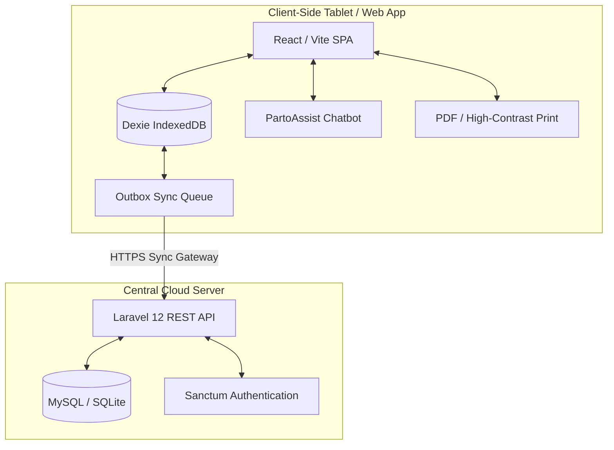

# 🏥 PartoCare: Digital Partograph & Connected Obstetrical Clinical Portal

PartoCare is a premium digital clinical assistant and connected portal designed to help midwives, nurses, and obstetricians monitor active labor, comply with WHO (World Health Organization) maternity guidelines, and save lives through early complication detection.

Designed to operate reliably in low-resource settings, PartoCare utilizes an **offline-first database architecture** to ensure clinical data entry is never interrupted, even in rural health facilities with unstable internet connections.

---

## 🚀 Key Features

- **📈 Interactive Digital Partograph:** Dynamic SVG charting of cervical dilatation, fetal heart rate (FHR), uterine contractions, maternal vitals, and fluid checks against standard WHO warning/action thresholds.
- **📶 Offline-First Synchronization:** Uses **Dexie.js (IndexedDB)** on the frontend to buffer patient cards, labor metrics, and outbox logs locally. Automatically syncs changes with the central database when connection returns.
- **🤖 PartoAssist Chatbot Assistant:** A bilingual clinical assistant embedded in the application. It provides real-time labor status summaries, alert tracking, and an interactive step-by-step onboarding guide (Steps 1–7) for new staff.
- **🌍 Bilingual Internationalization (FR / EN):** Seamless language switching across all dashboards, patient profile cards, and settings, persisting user preferences locally.
- **📄 Clinical Data Export & High-Contrast Print:** One-click JSON data backup and high-contrast CSS print stylesheets to generate clean paper records for patient physical charts.
- **🚨 Real-Time Diagnostic Warnings:** Active background checks for abnormal dilation speeds, maternal vital spikes, and fetal distress, notifying staff when emergency referrals are required.
- **🏥 Facility Onboarding:** Simple admin panel to onboard new health centers, clinics, and district referral systems.

---

## 🏗️ System Architecture



---

## 🛠️ Tech Stack

| Layer | Technologies |
| :--- | :--- |
| **Frontend Core** | React, TypeScript, Vite |
| **Frontend Styling** | Custom CSS (Modern, Responsive, Dark Theme, Print media) |
| **Local Storage** | Dexie.js (IndexedDB wrapper) |
| **Icons & UI Assets** | Lucide React |
| **Backend API** | Laravel 12, PHP |
| **Database** | MySQL / SQLite |
| **Authentication** | Laravel Sanctum |

---

## 💻 Local Installation & Setup

Follow these steps to clone the repository and run both the frontend and backend servers locally.

### Prerequisites
- [Node.js](https://nodejs.org/) (v18+ recommended)
- [PHP](https://www.php.net/) (v8.2+ recommended)
- [Composer](https://getcomposer.org/)

### 1. Backend Setup (Laravel)
1. Navigate to the backend directory:
   ```bash
   cd backend
   ```
2. Install Composer dependencies:
   ```bash
   composer install
   ```
3. Copy the environment file and configure your local settings:
   ```bash
   cp .env.example .env
   ```
4. Generate the application key:
   ```bash
   php artisan key:generate
   ```
5. Create the database (SQLite by default or configure MySQL in `.env`), and run the migrations:
   ```bash
   php artisan migrate --seed
   ```
6. Start the Laravel development server:
   ```bash
   php artisan serve
   ```
   *The API will run by default on `http://127.0.0.1:8000`.*

### 2. Frontend Setup (React/Vite)
1. Navigate to the frontend directory:
   ```bash
   cd ../frontend
   ```
2. Install dependencies:
   ```bash
   npm install
   ```
3. Start the Vite development server:
   ```bash
   npm run dev
   ```
   *The client will run by default on `http://localhost:5173` (or `http://localhost:3000`).*

---

## 🚢 Production Deployment

### Frontend (Vercel)
- Build the static bundle: `npm run build`
- Import the frontend project to Vercel, setting the framework preset to **Vite** and configuring the build outputs directory to `dist/`.

### Backend (Shared Hosting / InfinityFree)
Since SSH access is restricted on shared environments like InfinityFree:
1. Install optimized production dependencies locally:
   ```bash
   composer install --no-dev --optimize-autoloader
   ```
2. Configure a root `.htaccess` inside `backend/` to rewrite traffic to the `public/` directory:
   ```apache
   <IfModule mod_rewrite.c>
       RewriteEngine On
       RewriteRule ^(.*)$ public/$1 [L]
   </IfModule>
   ```
3. Upload all backend files to the server's `htdocs/` folder via FTP (e.g. FileZilla).
4. Create and import your database schema using phpMyAdmin, and update the remote `.env` credentials.

---

## 🔒 Security Hardening Checklists

- **Enforce HTTPS:** Secure connection transit.
- **CORS Policies:** Restrict allowed backend origins to the production frontend domain.
- **Offline Password Hashing:** For offline login, store encrypted passkeys in IndexedDB rather than raw emails.
- **Full-Disk Encryption:** Enforce tablet lock screens and encryption for physical device safety.
