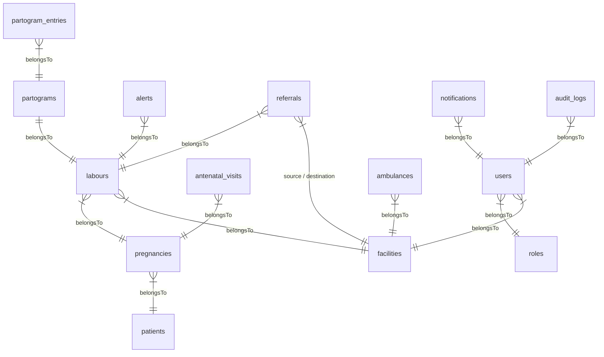

# Conception de la Base de Données (MySQL 8) - PartoCare

Ce document présente la structure physique de la base de données **MySQL 8** de PartoCare, configurée selon l'ERD de référence.

---

## 1. Modèle Relationnel (ERD)



---

## 2. Dictionnaire des Tables

Toutes les tables utilisent des identifiants uniques de type `CHAR(36)` pour les clés primaires et étrangères (UUID générés au niveau applicatif par Laravel), sauf mention contraire.

### 2.1. Table `roles`
Stocke les rôles de sécurité de la plateforme.
* **Valeurs possibles :** `ADMIN`, `DISTRICT_MANAGER`, `HOSPITAL_MANAGER`, `GYNECOLOGIST`, `DOCTOR`, `MIDWIFE`, `NURSE`.

| Champ | Type | Contraintes | Description |
| :--- | :--- | :--- | :--- |
| `id` | CHAR(36) | PRIMARY KEY | Identifiant unique du rôle. |
| `name` | VARCHAR(50) | UNIQUE, NOT NULL | Nom du rôle. |

### 2.2. Table `facilities`
Stocke les structures de santé de la cartographie.
* **Types possibles :** `CSI`, `CMA`, `District Hospital`, `Regional Hospital`, `Referral Hospital`.

| Champ | Type | Contraintes | Description |
| :--- | :--- | :--- | :--- |
| `id` | CHAR(36) | PRIMARY KEY | Identifiant unique. |
| `name` | VARCHAR(150) | NOT NULL | Nom du centre. |
| `type` | VARCHAR(50) | NOT NULL | Type de centre. |
| `region` | VARCHAR(100) | NOT NULL | Région sanitaire. |
| `district` | VARCHAR(100) | NOT NULL | District sanitaire. |
| `address` | TEXT | NULL | Adresse physique. |
| `phone` | VARCHAR(20) | NOT NULL | Téléphone du centre. |
| `latitude` | DECIMAL(9,6) | NULL | Latitude géographique. |
| `longitude` | DECIMAL(9,6) | NULL | Longitude géographique. |

### 2.3. Table `users`
Stocke les comptes utilisateurs des agents de santé.

| Champ | Type | Contraintes | Description |
| :--- | :--- | :--- | :--- |
| `id` | CHAR(36) | PRIMARY KEY | Identifiant unique. |
| `role_id` | CHAR(36) | FOREIGN KEY (`roles`), NOT NULL | Rôle associé. |
| `facility_id` | CHAR(36) | FOREIGN KEY (`facilities`), NOT NULL | Structure de santé de rattachement. |
| `first_name` | VARCHAR(100) | NOT NULL | Prénom de l'utilisateur. |
| `last_name` | VARCHAR(100) | NOT NULL | Nom de famille. |
| `email` | VARCHAR(100) | UNIQUE, NOT NULL | Adresse e-mail (login). |
| `phone` | VARCHAR(20) | NULL | Téléphone. |
| `password` | VARCHAR(255) | NOT NULL | Mot de passe chiffré (bcrypt). |
| `status` | VARCHAR(20) | DEFAULT 'ACTIVE' | Statut du compte (`ACTIVE`, `INACTIVE`). |
| `created_at` | TIMESTAMP | DEFAULT CURRENT_TIMESTAMP | Date de création. |

### 2.4. Table `patients`
Fiches d'identité des patientes.

| Champ | Type | Contraintes | Description |
| :--- | :--- | :--- | :--- |
| `id` | CHAR(36) | PRIMARY KEY | Identifiant unique. |
| `hospital_number` | VARCHAR(50) | UNIQUE, NOT NULL | Numéro de dossier hospitalier. |
| `first_name` | VARCHAR(100) | NOT NULL | Prénom de la patiente. |
| `last_name` | VARCHAR(100) | NOT NULL | Nom de famille. |
| `date_of_birth` | DATE | NOT NULL | Date de naissance. |
| `phone` | VARCHAR(20) | NULL | Téléphone portable. |
| `address` | TEXT | NULL | Adresse de résidence. |
| `blood_group` | VARCHAR(5) | NULL | Groupe sanguin (A+, B-, etc.). |
| `emergency_contact` | VARCHAR(255) | NOT NULL | Nom et téléphone du contact d'urgence. |
| `created_at` | TIMESTAMP | DEFAULT CURRENT_TIMESTAMP | Date d'enregistrement. |
| `updated_at` | TIMESTAMP | DEFAULT CURRENT_TIMESTAMP ON UPDATE CURRENT_TIMESTAMP | Date de modification. |

### 2.5. Table `pregnancies`
Grossesses associées aux patientes.

| Champ | Type | Contraintes | Description |
| :--- | :--- | :--- | :--- |
| `id` | CHAR(36) | PRIMARY KEY | Identifiant unique. |
| `patient_id` | CHAR(36) | FOREIGN KEY (`patients`), NOT NULL | Patiente concernée. |
| `gravidity` | INTEGER | NOT NULL | Nombre total de grossesses (y compris celle-ci). |
| `parity` | INTEGER | NOT NULL | Nombre d'accouchements viables. |
| `estimated_delivery_date` | DATE | NULL | Date d'accouchement prévue (EDD). |
| `gestational_age` | INTEGER | NULL | Âge gestationnel estimé (en semaines). |
| `risk_level` | VARCHAR(20) | DEFAULT 'LOW' | Niveau de risque (`LOW`, `MEDIUM`, `HIGH`). |

### 2.6. Table `antenatal_visits`
Visites de consultations prénatales (CPN).

| Champ | Type | Contraintes | Description |
| :--- | :--- | :--- | :--- |
| `id` | CHAR(36) | PRIMARY KEY | Identifiant unique. |
| `pregnancy_id` | CHAR(36) | FOREIGN KEY (`pregnancies`), NOT NULL | Grossesse liée. |
| `visit_date` | DATE | NOT NULL | Date de la consultation. |
| `weight` | DECIMAL(5,2) | NULL | Poids de la patiente (kg). |
| `blood_pressure` | VARCHAR(20) | NULL | Tension artérielle relevée. |
| `fetal_heart_rate` | INTEGER | NULL | Rythme cardiaque fœtal (bpm). |
| `notes` | TEXT | NULL | Commentaires cliniques. |

### 2.7. Table `labours`
Enregistrements des accouchements et phases de travail.

| Champ | Type | Contraintes | Description |
| :--- | :--- | :--- | :--- |
| `id` | CHAR(36) | PRIMARY KEY | Identifiant unique de la session de travail. |
| `pregnancy_id` | CHAR(36) | FOREIGN KEY (`pregnancies`), NOT NULL | Grossesse concernée. |
| `facility_id` | CHAR(36) | FOREIGN KEY (`facilities`), NOT NULL | Structure sanitaire d'admission. |
| `admission_datetime` | TIMESTAMP | NOT NULL | Heure et date d'admission. |
| `labour_status` | VARCHAR(20) | DEFAULT 'ACTIVE' | État du travail (`ACTIVE`, `REFERRED`, `DELIVERED`, `DISCHARGED`). |
| `outcome` | VARCHAR(100) | NULL | Issue de l'accouchement (voie basse, césarienne, etc.). |

### 2.8. Table `partograms`
Initialisation du tracé du partogramme pour un travail donné.

| Champ | Type | Contraintes | Description |
| :--- | :--- | :--- | :--- |
| `id` | CHAR(36) | PRIMARY KEY | Identifiant unique. |
| `labour_id` | CHAR(36) | FOREIGN KEY (`labours`), UNIQUE, NOT NULL | Travail lié (1-1). |
| `started_at` | TIMESTAMP | NOT NULL | Heure de début de la phase active. |
| `completed_at` | TIMESTAMP | NULL | Heure de fin du tracé. |

### 2.9. Table `partogram_entries`
Mesures périodiques relevées pendant la surveillance.

| Champ | Type | Contraintes | Description |
| :--- | :--- | :--- | :--- |
| `id` | CHAR(36) | PRIMARY KEY | Identifiant unique. |
| `partogram_id` | CHAR(36) | FOREIGN KEY (`partograms`), NOT NULL | Partogramme associé. |
| `observation_time` | TIMESTAMP | NOT NULL | Heure de relevé de la mesure. |
| `cervical_dilation` | INTEGER | NULL | Dilatation cervicale en cm ($0$ à $10$). |
| `fetal_heart_rate` | INTEGER | NULL | Rythme cardiaque fœtal (bpm). |
| `contractions` | INTEGER | NULL | Contractions en 10 min. |
| `maternal_temperature` | DECIMAL(3,1) | NULL | Température maternelle (°C). |
| `maternal_pulse` | INTEGER | NULL | Pouls maternel (bpm). |
| `blood_pressure` | VARCHAR(20) | NULL | Pression artérielle (ex: "120/80"). |
| `fetal_station` | VARCHAR(10) | NULL | Descente de la tête fœtale. |
| `membrane_status` | VARCHAR(20) | NULL | État membranes (`INTACT`, `RUPTURED`). |
| `amniotic_fluid_status`| VARCHAR(20) | NULL | État liquide (`CLEAR`, `MECONIUM`, `BLOODY`). |

### 2.10. Table `alerts`
Alertes cliniques générées automatiquement ou manuellement.
* **Types d'alertes :** `FETAL_DISTRESS`, `PROLONGED_LABOUR`, `PRE_ECLAMPSIA`, `ECLAMPSIA`, `HEMORRHAGE`, `INFECTION`.

| Champ | Type | Contraintes | Description |
| :--- | :--- | :--- | :--- |
| `id` | CHAR(36) | PRIMARY KEY | Identifiant unique. |
| `labour_id` | CHAR(36) | FOREIGN KEY (`labours`), NOT NULL | Travail lié. |
| `alert_level` | VARCHAR(15) | NOT NULL | Niveau de gravité (`GREEN`, `YELLOW`, `ORANGE`, `RED`). |
| `alert_type` | VARCHAR(50) | NOT NULL | Nature du risque. |
| `alert_message` | TEXT | NOT NULL | Message d'explication. |
| `generated_at` | TIMESTAMP | DEFAULT CURRENT_TIMESTAMP | Date de génération. |
| `resolved_at` | TIMESTAMP | NULL | Date de résolution. |

### 2.11. Table `referrals`
Procédure d'évacuation de patientes.
* **Status possibles :** `PENDING`, `ACCEPTED`, `IN_TRANSIT`, `ARRIVED`, `CLOSED`.

| Champ | Type | Contraintes | Description |
| :--- | :--- | :--- | :--- |
| `id` | CHAR(36) | PRIMARY KEY | Identifiant unique. |
| `labour_id` | CHAR(36) | FOREIGN KEY (`labours`), NOT NULL | Travail lié. |
| `source_facility_id` | CHAR(36) | FOREIGN KEY (`facilities`), NOT NULL | Structure d'origine. |
| `destination_facility_id`| CHAR(36) | FOREIGN KEY (`facilities`), NOT NULL | Structure de destination. |
| `referral_reason` | TEXT | NOT NULL | Raison clinique du transfert. |
| `referral_status` | VARCHAR(20) | DEFAULT 'PENDING' | Statut du transfert. |
| `departure_time` | TIMESTAMP | NULL | Heure effective de départ. |
| `arrival_time` | TIMESTAMP | NULL | Heure effective d'arrivée. |

### 2.12. Table `ambulances`
Flotte de véhicules d'urgence disponible.

| Champ | Type | Contraintes | Description |
| :--- | :--- | :--- | :--- |
| `id` | CHAR(36) | PRIMARY KEY | Identifiant unique. |
| `facility_id` | CHAR(36) | FOREIGN KEY (`facilities`), NOT NULL | Structure de rattachement. |
| `registration_number` | VARCHAR(20) | UNIQUE, NOT NULL | Plaque d'immatriculation. |
| `driver_name` | VARCHAR(100) | NOT NULL | Nom du chauffeur. |
| `driver_phone` | VARCHAR(20) | NOT NULL | Téléphone du chauffeur. |
| `availability_status` | VARCHAR(20) | DEFAULT 'AVAILABLE' | Disponibilité (`AVAILABLE`, `IN_MISSION`, `MAINTENANCE`). |

### 2.13. Table `notifications`
Enregistrements des notifications envoyées.

| Champ | Type | Contraintes | Description |
| :--- | :--- | :--- | :--- |
| `id` | CHAR(36) | PRIMARY KEY | Identifiant unique. |
| `user_id` | CHAR(36) | FOREIGN KEY (`users`), NOT NULL | Utilisateur ciblé. |
| `type` | VARCHAR(30) | NOT NULL | Type (`ALERT`, `REFERRAL`, `SYSTEM`). |
| `channel` | VARCHAR(30) | NOT NULL | Canal (`WHATSAPP`, `SMS`, `EMAIL`). |
| `message` | TEXT | NOT NULL | Corps du message. |
| `sent_at` | TIMESTAMP | NULL | Date d'envoi. |
| `delivery_status` | VARCHAR(20) | DEFAULT 'PENDING' | État de délivrance. |

### 2.14. Table `audit_logs`
Logs des actions de sécurité système.

| Champ | Type | Contraintes | Description |
| :--- | :--- | :--- | :--- |
| `id` | BIGINT UNSIGNED | AUTO_INCREMENT, PRIMARY KEY | Identifiant unique séquentiel. |
| `user_id` | CHAR(36) | FOREIGN KEY (`users`), NULL | Utilisateur ayant fait l'action. |
| `action` | VARCHAR(50) | NOT NULL | Type d'action (ex: CREATE, UPDATE). |
| `table_name` | VARCHAR(50) | NOT NULL | Table affectée. |
| `record_id` | CHAR(36) | NOT NULL | Ligne affectée. |
| `old_values` | JSON | NULL | Ancienne valeur. |
| `new_values` | JSON | NULL | Nouvelle valeur. |
| `created_at` | TIMESTAMP | DEFAULT CURRENT_TIMESTAMP | Date système. |

---

## 3. Optimisation des Index (MySQL 8)

```sql
CREATE INDEX idx_users_role ON users(role_id);
CREATE INDEX idx_users_facility ON users(facility_id);
CREATE INDEX idx_pregnancies_patient ON pregnancies(patient_id);
CREATE INDEX idx_antenatal_visits_pregnancy ON antenatal_visits(pregnancy_id);
CREATE INDEX idx_labours_pregnancy ON labours(pregnancy_id);
CREATE INDEX idx_labours_facility ON labours(facility_id);
CREATE INDEX idx_partograms_labour ON partograms(labour_id);
CREATE INDEX idx_partogram_entries_partogram ON partogram_entries(partogram_id);
CREATE INDEX idx_partogram_entries_time ON partogram_entries(partogram_id, observation_time DESC);
CREATE INDEX idx_alerts_labour ON alerts(labour_id);
CREATE INDEX idx_referrals_labour ON referrals(labour_id);
CREATE INDEX idx_referrals_source ON referrals(source_facility_id);
CREATE INDEX idx_referrals_destination ON referrals(destination_facility_id);
CREATE INDEX idx_ambulances_facility ON ambulances(facility_id);
CREATE INDEX idx_notifications_user ON notifications(user_id);
```
