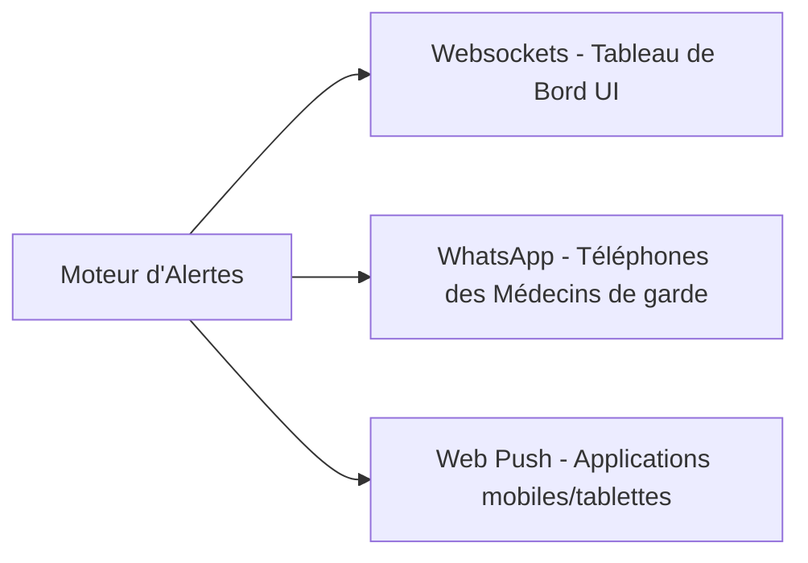

# Système de Notification et d'Alertes en Temps Réel - PartoCare

PartoCare utilise un système de notification multicanal pour garantir que les alertes médicales urgentes et les fiches de référence soient traitées dans les plus brefs délais.

## 1. Canaux de Notification

Trois canaux de communication complémentaires sont mis en œuvre :



### 1.1. Notifications Temps Réel Web (Websockets)
* **Technologie :** Pusher ou Socket.io.
* **Usage :** Mise à jour dynamique de la liste des patientes en cours d'accouchement sans rechargement de page. Lorsqu'un relevé clinique déclenche une alerte rouge, l'interface de la sage-femme et du médecin s'actualise instantanément.
* **UX sonore :** Les alertes de niveau **Rouge** déclenchent une alarme sonore douce mais distincte en salle de naissance pour avertir immédiatement l'équipe.

### 1.2. Notifications WhatsApp (WhatsApp Business API)
* **Technologie :** Intégration de l'API **WhatsApp Business**.
* **Usage :** Indispensable pour joindre les médecins d'astreinte hors ligne, en déplacement ou à domicile, en profitant de la popularité de WhatsApp en Afrique pour une réception quasi instantanée.
* **Contenu des Messages :** Format riche ou texte structuré contenant l'âge, l'initiale de la patiente, le motif de l'alerte et un lien de consultation rapide.
  * *Exemple de message :*
    > 🔴 **PartoCare - ALERTE ROUGE**
    > **Patiente :** F. Ebanda (28 ans)
    > **Lieu :** CMA de Ndiki
    > **Alerte :** Souffrance fœtale (Rythme Cardiaque Fœtal à 95 bpm - Bradycardie sévère).
    > **Contact Structure :** +237 677 123 456
    > [Cliquez ici pour voir le Partogramme](https://partocare.sante.cm/sessions/f8e7d6c5)

### 1.3. Notifications Push Web & Mobiles
* **Technologie :** Firebase Cloud Messaging (FCM).
* **Usage :** Alertes push système sur le téléphone portable des cliniciens même si le navigateur ou l'application est fermé en arrière-plan.

---

## 2. Structure des Messages de Notification (Payload JSON)

Lorsqu'un événement WebSocket ou WhatsApp est déclenché par le système, il respecte le format suivant :

```json
{
  "event": "patient.alert.triggered",
  "timestamp": "2026-06-01T04:32:00Z",
  "data": {
    "session_id": "f8e7d6c5-b4a3-2109-8765-432109876543",
    "patient_name": "Florence Ebanda",
    "center_name": "CMA de Ndiki",
    "alert": {
      "id": "cc001122-3344-5566-7788-99aabbccddee",
      "type": "fetal_distress",
      "severity": "red",
      "description": "Rythme Cardiaque Fœtal à 95 bpm (Bradycardie sévère)."
    }
  }
}
```

---

## 3. Algorithme d'Escalade des Alertes (Escalation Rules)

Pour éviter que des alertes critiques soient ignorées par inattention ou fatigue, PartoCare intègre un système d'escalade automatique :

1. **Niveau 1 (Alerte Initiale) :** L'alerte est affichée sur le tableau de bord local et envoyée par WebSocket. Un message WhatsApp automatisé est envoyé au médecin de garde du centre.
2. **Niveau 2 (Après 15 minutes) :** Si l'alerte Rouge n'est pas acquittée sur la plateforme dans les 15 minutes, un message WhatsApp de relance (avec relance sonore push) est envoyé au Médecin Chef de la maternité.
3. **Niveau 3 (Après 30 minutes) :** Si l'alerte reste sans action et qu'aucune demande de transfert n'a été initiée, le système envoie une alerte de supervision WhatsApp au Médecin Chef du District Sanitaire avec le statut critique de la patiente.
