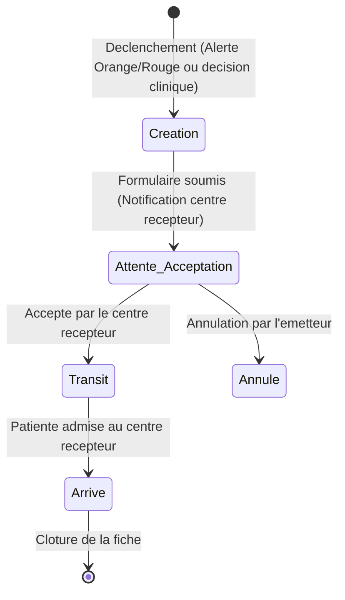

# Système de Référence Obstétricale - PartoCare

Le système de référence de PartoCare organise le transfert sécurisé des patientes présentant des complications depuis les maternités de premier niveau (centres de santé intégrés, CMA) vers les hôpitaux de référence (hôpitaux de district, régionaux).

## 1. Processus de Référence Obstétricale

Le cycle de vie d'une référence se déroule selon les étapes suivantes :

---

## 2. Description Détaillée des Étapes

### 2.1. Déclenchement & Aide au Choix du Centre
* **Recommandation automatique :** Lorsqu'une alerte Orange ou Rouge est détectée (ex: dilatation à droite de la ligne d'action), un bouton visible "Initier une référence" s'affiche en surbrillance.
* **Sélection de la destination :** Le système affiche une liste des centres de référence partenaires. Pour chaque centre, l'application indique :
  * Le niveau de plateau technique (ex: capacité de bloc opératoire pour césarienne d'urgence).
  * La disponibilité déclarée en lits ou en personnel de garde.
  * Les coordonnées de contact téléphonique direct.

### 2.2. Génération de la Fiche de Transfert
La fiche de transfert est automatiquement pré-remplie par le système avec :
* **Informations Patiente :** Nom, âge, urgence contact, gestité, parité.
* **Historique clinique :** Heure d'admission en travail, heure de rupture des membranes, antécédents médicaux.
* **Dernier relevé de constantes :** FCF, dilatation cervicale, contractions, pouls, tension artérielle, température.
* **Motifs cliniques :** Liste des alertes automatiques et notes textuelles saisies par la sage-femme.
* **Logistique :** Mode de transport choisi (ambulance du district, taxi, véhicule privé).

### 2.3. Notification et Handshake (Poignée de Main Numérique)
1. **Émission :** Lors de la soumission, la demande passe au statut `pending` (En attente d'acceptation).
2. **Réception :** L'hôpital de destination reçoit une alerte visuelle et sonore instantanée sur son tableau de bord PartoCare via des Websockets.
3. **Acceptation :** Le médecin de garde de l'hôpital récepteur clique sur "Accepter la référence". Le statut passe à `accepted` puis à `in_transit` lorsque le départ de la patiente est confirmé. Cette étape permet au centre récepteur de préparer la salle d'accouchement ou le bloc opératoire.

### 2.4. Arrivée & Admission Clinique
À l'arrivée de l'ambulance à l'hôpital de destination :
* Le médecin récepteur valide l'admission sur l'application. Le statut passe à `completed` (Arrivée).
* L'heure d'arrivée est enregistrée automatiquement.
* Une évaluation clinique d'entrée est saisie, clôturant la session de transfert originale et assurant la continuité des soins.
* Si le centre récepteur utilise également PartoCare, la session de travail de la patiente lui est automatiquement transférée, rendant tout l'historique graphique accessible au médecin.
