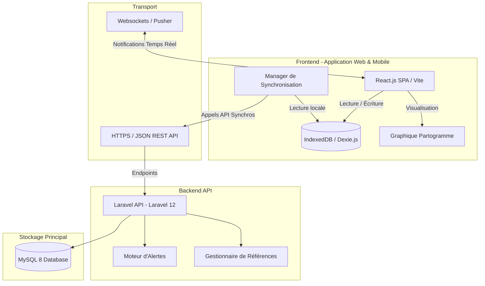

# Architecture Système & Choix Technologiques - PartoCare

Ce document décrit l'architecture globale de la plateforme PartoCare, les choix technologiques pour les composants Frontend et Backend, ainsi que la stratégie de synchronisation hors-ligne (Offline-First).

## 1. Vue d'Ensemble de l'Architecture

La plateforme utilise une architecture client-serveur découplée (API-centric) conçue pour être hautement disponible, sécurisée et capable de fonctionner dans des conditions de connectivité réseau instables.

---

## 2. Description des Composants

### 2.1. Frontend (Application Web)
* **Framework :** React.js avec TypeScript pour un typage statique rigoureux.
* **Outil de Build :** Vite.js pour des temps de compilation et de rechargement ultra-rapides.
* **Design & Styles :** **TailwindCSS** pour un style moderne, réactif et optimisé par classes utilitaires.
* **Gestion du State & Cache :** **React Query** pour la synchronisation, le cache et la mise à jour des états serveur côté client.
* **Navigation :** **React Router** pour la gestion fluide des routes de l'application.
* **Librairie de Graphique :** Recharts ou Chart.js personnalisée avec des tracés Canvas/SVG pour dessiner les lignes d'Alerte et d'Action du partogramme et l'état de la patiente.
* **Base de données Locale :** **Dexie.js** (surcouche d'IndexedDB) pour stocker les dossiers patientes, les sessions de travail et les observations en local sur la tablette ou l'ordinateur de la maternité.

### 2.2. Backend (API)
* **Framework :** **Laravel 12**. Offre un écosystème à la pointe (PHP 8.2+) pour la gestion de l'authentification (Sanctum), des migrations de base de données, des files d'attente (Laravel Queue) et du routage de l'API.
* **Architecture Interne :** Pattern Service-Repository. Les règles métiers complexes (ex: Moteur d'Alertes) sont isolées dans des services dédiés, tandis que les requêtes en base de données transitent par des Repositories pour faciliter les tests unitaires.
* **Base de Données :** **MySQL 8**. Système de gestion de base de données relationnelle robuste, optimisé pour la persistance des données transactionnelles cliniques.

---

## 3. Stratégie de Connectivité et Synchronisation (Offline-First)

L'un des défis majeurs dans les maternités périphériques en Afrique est l'instabilité d'Internet. PartoCare résout ce problème grâce à un fonctionnement déconnecté natif :

1. **Saisie des Données :** Toutes les actions d'écriture (ajout d'une patiente, enregistrement d'une observation) sont immédiatement validées et écrites dans **IndexedDB** en local. L'application reste réactive et utilisable même en l'absence de réseau.
2. **File d'Attente de Synchronisation (Outbox Pattern) :** Chaque modification locale génère une tâche dans une table locale `sync_queue` contenant l'action (Ex: `CREATE_PATIENT`, `ADD_OBSERVATION`) et les données associées.
3. **Vérification de la Connectivité :** Un service en arrière-plan surveille la connectivité réseau (via `navigator.onLine` et des requêtes de "ping" périodiques vers l'API).
4. **Resynchronisation Automatique :**
   * Dès que la connexion est rétablie, le `SyncManager` dépile les éléments de la `sync_queue` dans l'ordre chronologique et les envoie au backend via des endpoints de synchronisation en lot (batch endpoints).
   * En cas de conflit de synchronisation (ex: deux sages-femmes modifiant la même observation sur deux appareils différents), l'application applique la règle "Last Write Wins" basée sur l'horodatage ou propose une résolution manuelle.

---

## 4. Flux d'Information en Temps Réel

* **Websockets :** Utilisés pour notifier instantanément les hôpitaux de référence lorsqu'une fiche de transfert est générée par un centre de santé périphérique.
* **Notifications Push :** Intégrées dans l'application web pour alerter les médecins de garde sur leur téléphone ou leur écran d'administration en cas de passage d'une patiente en alerte Rouge.
