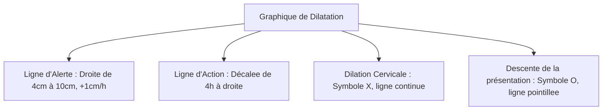

# Directives UI/UX et Charte Graphique - PartoCare

Ce document définit les directives ergonomiques et la charte graphique de PartoCare pour assurer une expérience utilisateur (UX) fluide, lisible et rassurante dans le contexte stressant d'une salle de naissance.

## 1. Principes de Design Clés

* **Simplicité de saisie :** Moins de saisie au clavier, plus de boutons d'incrémentation (sliders, selecteurs numériques, listes d'options prédéfinies). Le personnel soignant porte des gants ou s'occupe de la patiente.
* **Lisibilité en conditions difficiles :** L'interface doit être lisible dans des salles d'accouchement sombres ou fortement éclairées. Nous privilégions des contrastes élevés et une typographie claire.
* **Palette de couleurs sémantique :** Les couleurs d'alertes doivent immédiatement attirer l'attention sans générer de panique inutile.

---

## 2. Palette de Couleurs (Thème Sombre Premium)

Nous utilisons une palette de couleurs basée sur le modèle HSL pour assurer l'harmonie visuelle et des contrastes optimaux :

* **Couleurs de Fond & Conteneurs :**
  * Fond principal : HSL(222, 47%, 5%) — Bleu-noir très sombre (`#0b0f19`).
  * Cartes et conteneurs : HSL(222, 40%, 10%) — Bleu-gris ardoise sombre (`#111827`) avec effet de flou de verre (glassmorphism : `backdrop-filter: blur(10px)`).
  * Bordures : HSL(222, 30%, 18%) — Gris bleuté subtil.
* **Couleurs de Statut (Alertes) :**
  * **Vert (Normal) :** HSL(142, 70%, 45%) — Émeraude (`#10b981`).
  * **Jaune (Surveillance) :** HSL(45, 93%, 47%) — Ambre doré (`#f59e0b`).
  * **Orange (Risque élevé) :** HSL(24, 95%, 50%) — Orange de sécurité (`#f97316`).
  * **Rouge (Urgence) :** HSL(0, 84%, 48%) — Crimson vif (`#ef4444`).
* **Couleurs de Texte :**
  * Texte principal : HSL(210, 40%, 98%) — Blanc cassé.
  * Texte secondaire : HSL(215, 20%, 65%) — Gris bleuté clair.

---

## 3. Typographie
* **Police de caractères :** `Outfit` ou `Inter` (chargées via Google Fonts).
* **Hiérarchie visuelle :**
  * `h1` : 2.25rem, gras (poids 700), espacement des lettres serré.
  * `h2` : 1.5rem, demi-gras (poids 600).
  * `h3` : 1.125rem, demi-gras (poids 600).
  * Corps du texte : 1rem, régulier (poids 400), interlignage confortable (1.5).
  * Chiffres de constantes (ex: FCF, TA) : Police monospace ou semi-monospace pour éviter les sauts de mise en page.

---

## 4. Spécifications du Graphique du Partogramme (Visualisation)

Le partogramme numérique reproduit visuellement les courbes de travail de l'OMS :

### 4.1. Graphique de la Dilatation & Descente
* **Axe X :** Temps écoulé en heures depuis le début de la phase active (0 à 12+ heures, gradué toutes les heures).
* **Axe Y (Gauche) :** Dilatation cervicale en centimètres (de 4 à 10 cm, gradué de 1 en 1).
* **Axe Y (Droite) :** Descente de la présentation (de 5/5 à 0/5, gradué de 1 en 1, inversé pour simuler la descente dans le bassin).
* **Symboles de Tracé :**
  * La **dilatation cervicale** est tracée avec des croix **`X`** rouges ou blanches, reliées par une ligne continue.
  * La **descente de la tête fœtale** est tracée avec des cercles **`O`** bleus ou verts, reliés par une ligne pointillée.

### 4.2. Graphique du Rythme Cardiaque Fœtal (FCF)
* Placé juste au-dessus ou au-dessous du graphique de dilatation.
* **Axe Y :** Battements par minute (de 80 à 200 bpm).
* **Bande de sécurité (Normale) :** Une zone ombrée de couleur verte pâle (semi-transparente) s'étend entre **110 bpm** et **160 bpm** pour indiquer visuellement la zone normale.
* **Points de mesure :** Représentés par des disques pleins reliés par une ligne continue.

### 4.3. Représentation des Contractions Utérines
* Placé en bas du partogramme sous forme de grille de rectangles de 5 rangées (une rangée par contraction possible en 10 minutes).
* **Axe X :** Heures de suivi.
* **Remplissage des rectangles selon la durée :**
  * **Moins de 20 secondes :** Remplissage par des points (représente des contractions faibles).
  * **Entre 20 et 40 secondes :** Remplissage par des hachures diagonales (contractions moyennes).
  * **Plus de 40 secondes :** Remplissage noir uni (contractions fortes).
